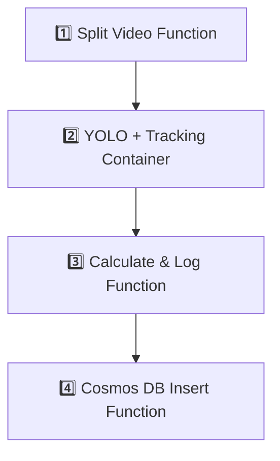

# Vehicle Speed Calculation

**Vehicle Speed Calculation** is a serverless system deployed on Azure, designed to analyze highway or road videos in order to:
- Detect and track vehicles
- Calculate their speed
- Identify speed violations
- Store statistical insights in a NoSQL database

---

## System Architecture Flow

---

## Components & Repositories

| Step | Repository | Description |
|------|------------|-------------|
| 1️⃣ | [Split-Video---Azure-Function](https://github.com/ChristosBaboulis/Split-Video---Azure-Function) | Azure Function that splits uploaded videos into 2-minute segments using ffmpeg |
| 2️⃣ | [Yolo-Container](https://github.com/ChristosBaboulis/Yolo-Container) | Azure Container App with YOLOv8 + OpenCV for vehicle detection and speed estimation |
| 3️⃣ | [Calculate-Result](https://github.com/ChristosBaboulis/Calculate-Result) | Azure Function that aggregates all segment logs into `total.log` with summaries |
| 4️⃣ | [Cosmos-DB-Fill](https://github.com/ChristosBaboulis/Cosmos-DB-Fill) | Azure Function that parses `total.log` and inserts structured vehicle data into Cosmos DB (NoSQL) |

---

## Tech Stack

- Python 3.10+
- Azure Functions (Blob Triggers)
- Azure Blob Storage
- Azure Event Grid & Event Hub (Kafka-compatible)
- Azure Container Apps (Dockerized)
- Ultralytics YOLOv8
- OpenCV
- Azure Cosmos DB (NoSQL, schema-less JSON)
- Regex-based log parsing

---

## Output

The final output is a `total.log` file containing:
- Per-vehicle speed and metadata
- Detected speed violations
- Average speed per direction and 5-minute intervals
- Vehicle counts per lane and interval

---

## ℹNote

The Azure backend is no longer active, but each component remains operational as part of a modular FaaS pipeline and can be reused or migrated to other environments.

---

## Author

**Christos Baboulis**  
GitHub: [@ChristosBaboulis](https://github.com/ChristosBaboulis)  
Email: christos.baboulis@gmail.com

---

## Acknowledgments

This project was developed as part of an MSc academic assignment in the course "Cloud Computing", focusing on serverless architectures, computer vision, and event-driven pipelines using Azure.  
Special thanks to the open-source communities of [Ultralytics](https://github.com/ultralytics/ultralytics) and [OpenCV](https://opencv.org/) for their foundational tools.
